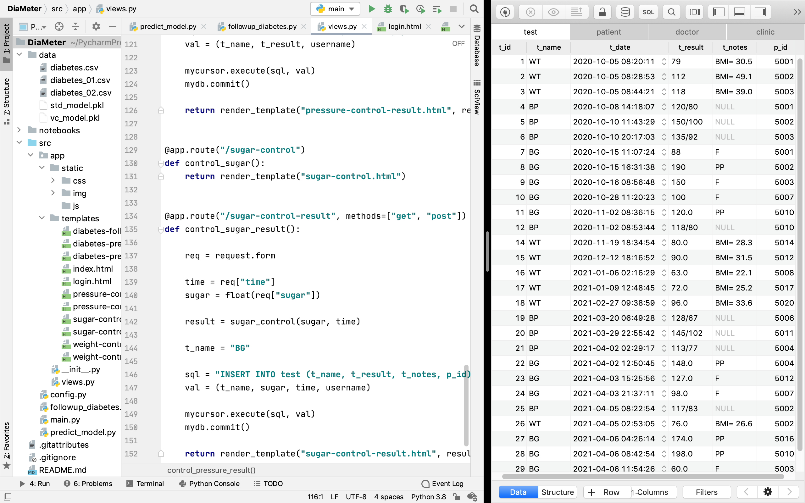

# DiaMeter: Diabetes Prediction & Follow-up

DiaMeter is a graduation project submitted to College of Computer and Information Technology, Shaqra University in partial fulfillment of the requirements for the degree of Bachelor in Computer Science.

## Table of Contents
- [Introduction](#introduction)
	- [Problem Description and Motivation](#problem-description-and-motivation)
	- [Objectives and Proposed Methodology](#objectives-and-proposed-methodology)
- [DiaMeter's Dataset and Database](#diameters-dataset-and-database)
	- [Dataset Overview](#dataset-overview)
	- [Data Cleaning](#data-cleaning)
	- [Missing Data Imputation](#missing-data-imputation)
	- [Dataset Transformation](#dataset-transformation)
	- [Dataset Splitting](#dataset-splitting)
	- [Database Development](#database-development)
- [DiaMeter's Machine Learning Model](#diameters-machine-learning-model)
- [DiaMeter's User Interface](#diameters-user-interface)
- [Tools and Technologies Involved](#tools-and-technologies-involved)
- [Design Overview (UI / UX)](#design-overview-ui--ux)
	- [Developer Perspective](#developer-perspective)
	- [User Perspective](#user-perspective)
- [Installation Guide](#installation-guide)

## Introduction
### Problem Description and Motivation
Since diabetes has become one of the most common causes of death and the cause of many other serious diseases. And the significant increase in the number of diabetics in the world in general and in Saudi Arabia in particular. It become important that an advanced system be implemented and used to predict diabetes and monitor diabetes patients. In addition, this system should be accessible and usable for non-professionals. 
Doctors diagnose diabetes by examining the symptoms that appear on patients and looking at the test results. In addition, specialists can determine a person's risk of developing diabetes by looking at the influencing factors. And since diabetes is one of the most diseases that need continuous routine follow-up, patients must visit the doctor continuously to see if any positive or negative complications of the disease occur and adjust their lifestyle accordingly.

### Objectives and Proposed Methodology
There are two main objectives of the project. First, Diameter will allow everyone to predict the risk of developing diabetes by answering the related questions, such as age, weight, blood pressure. We used VotingClassifier model to combine conceptually different machine learning classifiers (LGBMClassifier, KNeighborsClassifier and GradientBoostingClassifier) and use the average predicted probabilities to balance out their individual weaknesses. And by training this model on The Pima Indians Diabetes dataset from The National Institute of Diabetes and Digestive and Kidney Diseases. DiaMeter will analyze these values and give an accurate prediction and the advice that must be followed to improve their lifestyle. 
Additionally, DiaMeter will allow diabetics and doctors to follow-up: the blood sugar levels, change in weight, blood pressure level, and help them to adjust their lifestyle by calculating the appropriate calories for each person according to their age, weight and the goal they seek to reach.

## DiaMeter's Dataset and Database
### Dataset Overview
Data Source: The Pima Indians Diabetes dataset is originally from the National Institute of Diabetes and Digestive and Kidney Diseases. 
The dataset has 768 samples of diabetic and healthy individuals. 
The dataset consist of several medical predictor variables such as BMI, blood pressure level, age. In addition to one target variable which is the outcome.

### Data Cleaning
Data cleaning is the process of fixing or removing incorrect, corrupted, incorrectly formatted, duplicate, or incomplete data within a dataset. 
As we can see, the zero values in some of the variables is meaningless. It indicates missing values. Ignoring them can significantly affect the accuracy of the model we are trying to build. 
There are two common ways of handling missing data, which are; entirely removing the observations from the data set or imputing a new value based on other observations.

### Missing Data Imputation
We replaced the missing values with the median value for each feature after excluding the missing data. Taking into consideration the target value; to get the most accurate result possible.

| Features | Records with 0 Value | % of Total Records | Median for Outcome 0 | Median for Outcome 1 |
|:--|:--|:--|:--|:--|
| Glucose | 5 | 0.65% | 107.0 | 140.0 |
| BloodPressure | 35 | 4.56% | 70.0 | 74.5 |
| SkinThickness | 227 | 29.56% | 27.0 | 32.0 |
| Insulin | 374 | 48.7% | 102.5 | 169.5 |
| BMI | 11 | 1.43% | 30.1 | 34.3 |

### Dataset Transformation
Data transformation is one of the fundamental steps in processing. It can significantly improve the accuracy of the machine learning model. 
We used data standardization to rescale the distribution of values and export the model to use it with the new input data.

### Dataset Splitting
Using K-Folds Cross Validation we split our data into k (5) different subsets (folds). We use k-1 folds to train our data and leave the last fold as test data. We then average the model against each of the folds and then finalize our model.

### Database Development
The database is a basic pillar as the second goal of the project is to follow up on diabetics, where their information and medical records, clinics and doctors' data, login information for all users will be stored. In order for doctors to view the reports when needed, and for DiaMeter to give appropriate instructions to each user. 
In this project we used MySQL, which is the world’s most popular open source database.

## DiaMeter's Machine Learning Model
We used VotingClassifier model to combine conceptually different machine learning classifiers (LGBMClassifier, KNeighborsClassifier and GradientBoostingClassifier) and use the average predicted probabilities to balance out their individual weaknesses.

| **Model’s Performance** |  |  |  |
|:--|:--|:--|:--|
| Accuracy | 89.6% | Precision | 86.4% |
| Recall | 83.6% | F1 score | 84.9% |
| **Confusion Matrix** |  |  |  |
| True Positives | 224 | False Positives | 36 |
| True Negatives | 464 | False Negatives | 44 |

## DiaMeter's User Interface
User interface is important to meet user expectations and support the effective functionality of DiaMeter. 
That's why we used Flask which is a lightweight WSGI web application framework. Although it doesn’t include an ORM (Object Relational Manager) or such features. It does have many cool features like url routing, template engine. And it is considered as one of the most popular Python web application frameworks.

## Tools and Technologies Involved
- **macOS:** Operating System
- **PyCharm:** Python IDE
- **TablePlus:** Database Client
- **iA Writer, Pages:** Documentation
- **Keynote:** Presentation
- **StarUML, OmniPlan, MindNode, Pixelmator:** Designing
- **GitHub:** Version Control
- **MySQL:** Project Database
- **Python:** Project Backend
	- **Pandas:** for data analysis and manipulation
	- **NumPy:** for scientific computing
	- **Scikit-learn:** for machine learning, including data processing, metrics and modeling
	- **LightGBM:** for machine learning modeling
	- **Plotly:** for data analysis and visualization
	- **Flask:** for web application development

## Design Overview (UI / UX)
### Developer Perspective

### User Perspective

## Installation Guide
1. Install [MySQL](https://dev.mysql.com/downloads/mysql/)
2. Import DiaMeter's Database by running the following command line: `mysql -u root -p DiaMeter < data/DiaMeter.dump`
3. Install [Python](https://www.python.org/downloads/)
4. Install the required libraries by running the following command line: `pip install -r requirements.txt`
5. (Optional) Install [PyCharm](https://www.jetbrains.com/pycharm/download/) and import the project and run `src/main.py`
6. Run the project using the following command line: `python src/main.py`
7. You can now access the flask server at `http://127.0.0.1:5000/`
